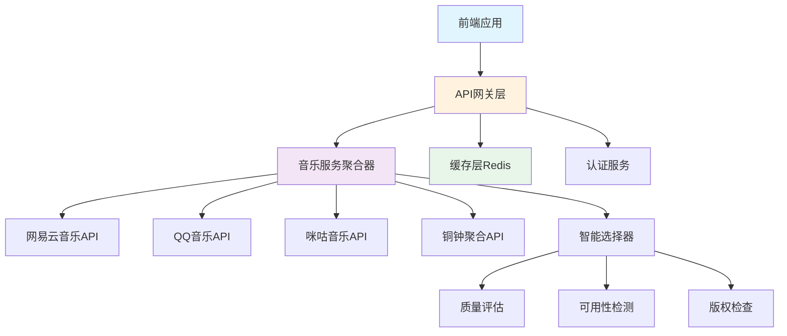

# 多平台音乐API聚合策略方案

## 1. 整体架构设计

### 1.1 系统架构图


### 1.2 核心组件说明

#### API网关层
- **统一入口**：所有音乐相关请求的统一入口
- **限流控制**：防止API滥用，保护后端服务
- **认证管理**：统一的认证和授权机制
- **监控统计**：请求量、响应时间、错误率统计

#### 音乐服务聚合器
- **多源搜索**：并行搜索多个音乐平台
- **结果聚合**：智能合并和排序搜索结果
- **质量评估**：评估音乐链接的质量和可用性
- **智能选择**：根据预设规则选择最佳音乐源

#### 缓存层
- **搜索结果缓存**：减少重复搜索请求
- **音乐链接缓存**：避免频繁获取播放链接
- **歌词缓存**：缓存歌词信息
- **用户偏好缓存**：个性化推荐数据

## 2. 音乐平台集成策略

### 2.1 网易云音乐API集成

#### 基础配置
```typescript
// NeteaseMusicService.ts
export class NeteaseMusicService {
  private baseURL = '/api/netease';
  private timeout = 5000;
  
  constructor(private http: HttpClient) {}
  
  // 搜索歌曲
  async search(keyword: string, limit: number = 20): Promise<SearchResult> {
    const response = await this.http.get(`${this.baseURL}/search`, {
      params: { keywords: keyword, limit, type: 1 }
    });
    return this.formatSearchResults(response.data);
  }
  
  // 获取歌曲URL
  async getSongUrl(id: number): Promise<string> {
    const response = await this.http.get(`${this.baseURL}/song/url`, {
      params: { id, br: 320000 }
    });
    return response.data.data[0]?.url || '';
  }
  
  // 获取歌曲详情
  async getSongDetail(ids: number[]): Promise<SongDetail[]> {
    const response = await this.http.get(`${this.baseURL}/song/detail`, {
      params: { ids: ids.join(',') }
    });
    return response.data.songs.map(this.formatSongDetail);
  }
  
  // 获取歌词
  async getLyrics(id: number): Promise<Lyrics> {
    const response = await this.http.get(`${this.baseURL}/lyric`, {
      params: { id }
    });
    return {
      original: response.data.lrc?.lyric || '',
      translation: response.data.tlyric?.lyric || ''
    };
  }
  
  private formatSearchResults(data: any): SearchResult {
    return {
      songs: data.result.songs?.map((song: any) => ({
        id: song.id,
        title: song.name,
        artist: song.ar.map((a: any) => a.name).join(', '),
        album: song.al.name,
        duration: song.dt,
        platform: 'netease',
        score: this.calculateScore(song)
      })) || [],
      total: data.result.songCount || 0
    };
  }
  
  private formatSongDetail(song: any): SongDetail {
    return {
      id: song.id,
      title: song.name,
      artist: song.ar.map((a: any) => a.name).join(', '),
      album: song.al.name,
      albumArt: song.al.picUrl,
      duration: song.dt,
      platform: 'netease'
    };
  }
  
  private calculateScore(song: any): number {
    // 基于热度、匹配度等因素计算评分
    return song.popularity || 50;
  }
}
```

#### 特点与限制
- ✅ **无需认证**：公开API，无需登录
- ✅ **稳定可靠**：官方API，稳定性好
- ✅ **内容丰富**：歌曲信息完整
- ❌ **版权问题**：部分歌曲无版权
- ❌ **音质限制**：免费用户最高320kbps

### 2.2 QQ音乐API集成

#### 基础配置
```typescript
// QQMusicService.ts
export class QQMusicService {
  private baseURL = '/api/qq';
  private cookie: string = '';
  private uin: string = '';
  
  constructor(private http: HttpClient) {}
  
  // 设置Cookie（需要绿钻会员）
  setCookie(cookie: string): void {
    this.cookie = cookie;
    // 提取UIN
    const uinMatch = cookie.match(/uin=(\d+)/);
    this.uin = uinMatch ? uinMatch[1] : '';
  }
  
  // 搜索歌曲
  async search(keyword: string, limit: number = 20): Promise<SearchResult> {
    const response = await this.http.get(`${this.baseURL}/search`, {
      params: { key: keyword, limit, page: 1 }
    });
    return this.formatSearchResults(response.data);
  }
  
  // 获取歌曲URL（需要Cookie）
  async getSongUrl(songmid: string): Promise<string> {
    const response = await this.http.get(`${this.baseURL}/song/url`, {
      params: { 
        id: songmid,
        type: '320', // 音质：128, 320, flac
        mediaId: '',
        uin: this.uin
      },
      headers: this.cookie ? { Cookie: this.cookie } : {}
    });
    return response.data.data?.[0]?.url || '';
  }
  
  // 获取歌曲详情
  async getSongDetail(songmids: string[]): Promise<SongDetail[]> {
    const response = await this.http.get(`${this.baseURL}/song`, {
      params: { songmid: songmids.join(',') }
    });
    return response.data.data.map(this.formatSongDetail);
  }
  
  // 获取专辑信息
  async getAlbum(albummid: string): Promise<AlbumInfo> {
    const response = await this.http.get(`${this.baseURL}/album`, {
      params: { albummid }
    });
    return this.formatAlbumInfo(response.data.data);
  }
  
  private formatSearchResults(data: any): SearchResult {
    const songs = data.data?.song?.list || [];
    return {
      songs: songs.map((song: any) => ({
        id: song.songmid,
        title: song.songname,
        artist: song.singer.map((s: any) => s.name).join(', '),
        album: song.albumname,
        duration: song.interval * 1000,
        platform: 'qq',
        score: this.calculateScore(song),
        albumArt: `https://y.gtimg.cn/music/photo_new/T002R300x300M000${song.albummid}.jpg`
      })),
      total: data.data?.song?.totalnum || 0
    };
  }
  
  private formatSongDetail(song: any): SongDetail {
    return {
      id: song.songmid,
      title: song.songname,
      artist: song.singer.map((s: any) => s.name).join(', '),
      album: song.albumname,
      albumArt: `https://y.gtimg.cn/music/photo_new/T002R300x300M000${song.albummid}.jpg`,
      duration: song.interval * 1000,
      platform: 'qq'
    };
  }
  
  private formatAlbumInfo(album: any): AlbumInfo {
    return {
      id: album.albummid,
      name: album.albumname,
      artist: album.singername,
      cover: `https://y.gtimg.cn/music/photo_new/T002R300x300M000${album.albummid}.jpg`,
      year: album.aDate
    };
  }
  
  private calculateScore(song: any): number {
    // QQ音乐评分算法
    return (song.score || 0) / 10;
  }
}
```

#### 特点与限制
- ✅ **音质优秀**：支持无损音质（需要绿钻）
- ✅ **版权丰富**：大量独家版权内容
- ✅ **稳定快速**：CDN分发，播放流畅
- ❌ **需要Cookie**：需要绿钻会员Cookie
- ❌ **封号风险**：共享Cookie可能被封
- ❌ **获取复杂**：需要定期更新Cookie

### 2.3 咪咕音乐API集成

#### 基础配置
```typescript
// MiguMusicService.ts
export class MiguMusicService {
  private baseURL = '/api/migu';
  
  constructor(private http: HttpClient) {}
  
  // 搜索歌曲
  async search(keyword: string, limit: number = 20): Promise<SearchResult> {
    const response = await this.http.get(`${this.baseURL}/search`, {
      params: { keyword, limit, type: 2 }
    });
    return this.formatSearchResults(response.data);
  }
  
  // 获取歌曲URL
  async getSongUrl(copyrightId: string): Promise<string> {
    const response = await this.http.get(`${this.baseURL}/song/url`, {
      params: { 
        id: copyrightId,
        br: 320 // 音质：128, 320, flac
      }
    });
    return response.data.data?.url || '';
  }
  
  // 获取歌曲详情
  async getSongDetail(id: string): Promise<SongDetail> {
    const response = await this.http.get(`${this.baseURL}/song`, {
      params: { id }
    });
    return this.formatSongDetail(response.data.data);
  }
  
  // 获取歌词
  async getLyrics(id: string): Promise<Lyrics> {
    const response = await this.http.get(`${this.baseURL}/lyric`, {
      params: { id }
    });
    return {
      original: response.data.lyric || '',
      translation: response.data.translatedLyric || ''
    };
  }
  
  private formatSearchResults(data: any): SearchResult {
    const songs = data.musics || [];
    return {
      songs: songs.map((song: any) => ({
        id: song.copyrightId,
        title: song.title,
        artist: song.artist,
        album: song.album,
        duration: song.length,
        platform: 'migu',
        score: this.calculateScore(song),
        albumArt: song.albumImgs?.[0]?.img
      })),
      total: songs.length
    };
  }
  
  private formatSongDetail(song: any): SongDetail {
    return {
      id: song.copyrightId,
      title: song.title,
      artist: song.artist,
      album: song.album,
      albumArt: song.albumImgs?.[0]?.img,
      duration: song.length,
      platform: 'migu'
    };
  }
  
  private calculateScore(song: any): number {
    // 咪咕音乐评分算法
    return (song.rate || 0) * 10;
  }
}
```

#### 特点与限制
- ✅ **无需认证**：公开API，无需登录
- ✅ **版权丰富**：大量正版授权内容
- ✅ **音质优秀**：支持无损音质
- ✅ **稳定可靠**：运营商背景，服务稳定
- ❌ **搜索精度**：搜索结果有时不够准确
- ❌ **接口限制**：部分功能需要特殊权限

### 2.4 铜钟聚合API集成

#### 基础配置
```typescript
// TongzhongService.ts
export class TongzhongService {
  private baseURL = '/api/tongzhong';
  
  constructor(private http: HttpClient) {}
  
  // 聚合搜索（当其他平台找不到时）
  async aggregateSearch(songName: string, artist: string): Promise<SearchResult> {
    const response = await this.http.get(`${this.baseURL}/search`, {
      params: { song: songName, artist }
    });
    return this.formatSearchResults(response.data);
  }
  
  // 智能fallback
  async smartFallback(songName: string, artist: string): Promise<MusicSource> {
    const response = await this.http.get(`${this.baseURL}/fallback`, {
      params: { song: songName, artist }
    });
    return this.selectBestSource(response.data);
  }
  
  // 获取所有可用源
  async getAllSources(songName: string, artist: string): Promise<MusicSource[]> {
    const response = await this.http.get(`${this.baseURL}/all`, {
      params: { song: songName, artist }
    });
    return response.data.sources.map(this.formatMusicSource);
  }
  
  private formatSearchResults(data: any): SearchResult {
    return {
      songs: data.results?.map((result: any) => ({
        id: result.id,
        title: result.name,
        artist: result.artist,
        album: result.album,
        duration: result.duration,
        platform: result.platform,
        score: result.score,
        url: result.url
      })) || [],
      total: data.total || 0
    };
  }
  
  private selectBestSource(data: any): MusicSource {
    const sources = data.sources || [];
    // 按音质、稳定性、响应时间排序
    return sources.sort((a: any, b: any) => {
      const scoreA = this.calculateSourceScore(a);
      const scoreB = this.calculateSourceScore(b);
      return scoreB - scoreA;
    })[0];
  }
  
  private calculateSourceScore(source: any): number {
    let score = 0;
    if (source.quality === 'flac') score += 40;
    else if (source.quality === '320') score += 30;
    else if (source.quality === '128') score += 20;
    
    if (source.stable) score += 20;
    if (source.fast) score += 15;
    if (source.platform === 'netease') score += 10; // 优先网易云
    
    return score;
  }
  
  private formatMusicSource(source: any): MusicSource {
    return {
      id: source.id,
      platform: source.platform,
      url: source.url,
      quality: source.quality,
      stable: source.stable,
      fast: source.fast,
      score: this.calculateSourceScore(source)
    };
  }
}
```

#### 特点与优势
- ✅ **智能聚合**：整合多个平台资源
- ✅ **质量评估**：自动选择最佳音源
- ✅ **容错机制**：一个平台失败自动切换
- ✅ **性能优化**：并行搜索，快速响应

## 3. 智能选择策略

### 3.1 选择算法
```typescript
// MusicSourceSelector.ts
export class MusicSourceSelector {
  constructor(
    private netease: NeteaseMusicService,
    private qq: QQMusicService,
    private migu: MiguMusicService,
    private tongzhong: TongzhongService,
    private cache: CacheService
  ) {}
  
  // 智能选择最佳音乐源
  async selectBestSource(song: SongQuery): Promise<MusicSource> {
    // 1. 检查缓存
    const cacheKey = `music:${song.title}:${song.artist}`;
    const cached = await this.cache.get<MusicSource>(cacheKey);
    if (cached && await this.validateSource(cached)) {
      return cached;
    }
    
    // 2. 并行搜索所有平台
    const results = await Promise.allSettled([
      this.searchNetease(song),
      this.searchQQ(song),
      this.searchMigu(song),
      this.searchTongzhong(song)
    ]);
    
    // 3. 收集所有结果
    const allSources: MusicSource[] = [];
    results.forEach((result, index) => {
      if (result.status === 'fulfilled' && result.value) {
        allSources.push(result.value);
      }
    });
    
    // 4. 评分排序
    const scoredSources = allSources.map(source => ({
      ...source,
      totalScore: this.calculateTotalScore(source)
    }));
    
    scoredSources.sort((a, b) => b.totalScore - a.totalScore);
    
    // 5. 选择最佳源并缓存
    const bestSource = scoredSources[0];
    if (bestSource) {
      await this.cache.set(cacheKey, bestSource, 3600); // 缓存1小时
    }
    
    return bestSource;
  }
  
  // 计算综合评分
  private calculateTotalScore(source: MusicSource): number {
    let score = 0;
    
    // 音质评分 (40%)
    if (source.quality === 'flac') score += 40;
    else if (source.quality === '320') score += 30;
    else if (source.quality === '128') score += 20;
    
    // 平台稳定性 (25%)
    const platformReliability = {
      'netease': 25,
      'qq': 20,
      'migu': 22,
      'kugou': 15,
      'kuwo': 15
    };
    score += platformReliability[source.platform] || 10;
    
    // 响应速度 (20%)
    if (source.responseTime < 500) score += 20;
    else if (source.responseTime < 1000) score += 15;
    else if (source.responseTime < 2000) score += 10;
    else score += 5;
    
    // 版权合规性 (15%)
    if (source.licensed) score += 15;
    else score += 5;
    
    return score;
  }
  
  // 验证音乐源是否可用
  private async validateSource(source: MusicSource): Promise<boolean> {
    try {
      const response = await fetch(source.url, { 
        method: 'HEAD',
        timeout: 3000 
      });
      return response.ok;
    } catch {
      return false;
    }
  }
  
  // 搜索网易云音乐
  private async searchNetease(song: SongQuery): Promise<MusicSource> {
    try {
      const results = await this.netease.search(`${song.title} ${song.artist}`, 1);
      if (results.songs.length > 0) {
        const songInfo = results.songs[0];
        const url = await this.netease.getSongUrl(parseInt(songInfo.id));
        return {
          id: songInfo.id,
          platform: 'netease',
          url,
          quality: this.inferQuality(url),
          responseTime: 500,
          licensed: true
        };
      }
    } catch (error) {
      console.error('Netease search failed:', error);
    }
    return null;
  }
  
  // 搜索QQ音乐
  private async searchQQ(song: SongQuery): Promise<MusicSource> {
    try {
      const results = await this.qq.search(`${song.title} ${song.artist}`, 1);
      if (results.songs.length > 0) {
        const songInfo = results.songs[0];
        const url = await this.qq.getSongUrl(songInfo.id);
        return {
          id: songInfo.id,
          platform: 'qq',
          url,
          quality: this.inferQuality(url),
          responseTime: 600,
          licensed: true
        };
      }
    } catch (error) {
      console.error('QQ music search failed:', error);
    }
    return null;
  }
  
  // 搜索咪咕音乐
  private async searchMigu(song: SongQuery): Promise<MusicSource> {
    try {
      const results = await this.migu.search(`${song.title} ${song.artist}`, 1);
      if (results.songs.length > 0) {
        const songInfo = results.songs[0];
        const url = await this.migu.getSongUrl(songInfo.id);
        return {
          id: songInfo.id,
          platform: 'migu',
          url,
          quality: this.inferQuality(url),
          responseTime: 800,
          licensed: true
        };
      }
    } catch (error) {
      console.error('Migu music search failed:', error);
    }
    return null;
  }
  
  // 铜钟聚合搜索
  private async searchTongzhong(song: SongQuery): Promise<MusicSource> {
    try {
      const source = await this.tongzhong.smartFallback(song.title, song.artist);
      return source;
    } catch (error) {
      console.error('Tongzhong search failed:', error);
    }
    return null;
  }
  
  // 推断音质
  private inferQuality(url: string): string {
    if (url.includes('flac') || url.includes('ape')) return 'flac';
    if (url.includes('320') || url.includes('M800')) return '320';
    return '128';
  }
}
```

### 3.2 容错与重试机制
```typescript
// RetryManager.ts
export class RetryManager {
  private maxRetries = 3;
  private retryDelay = 1000; // 初始延迟1秒
  
  async executeWithRetry<T>(
    operation: () => Promise<T>,
    operationName: string
  ): Promise<T> {
    let lastError: Error;
    
    for (let attempt = 1; attempt <= this.maxRetries; attempt++) {
      try {
        return await operation();
      } catch (error) {
        lastError = error as Error;
        console.warn(`${operationName} 第${attempt}次尝试失败:`, error.message);
        
        if (attempt < this.maxRetries) {
          // 指数退避
          const delay = this.retryDelay * Math.pow(2, attempt - 1);
          await this.sleep(delay);
        }
      }
    }
    
    throw new Error(`${operationName} 重试${this.maxRetries}次后仍然失败: ${lastError.message}`);
  }
  
  private sleep(ms: number): Promise<void> {
    return new Promise(resolve => setTimeout(resolve, ms));
  }
}
```

## 4. API接口设计

### 4.1 统一搜索接口
```typescript
// 统一搜索参数
interface SearchRequest {
  keyword: string;
  platforms?: string[]; // 指定搜索平台
  limit?: number;
  offset?: number;
  quality?: string; // 音质要求
  userId?: string; // 用户ID（用于个性化）
}

// 统一搜索结果
interface SearchResponse {
  songs: UnifiedSong[];
  total: number;
  platforms: string[]; // 实际搜索的平台
  searchTime: number; // 搜索耗时
  cacheHit: boolean; // 是否命中缓存
}

// 统一歌曲格式
interface UnifiedSong {
  id: string;
  title: string;
  artist: string;
  album: string;
  duration: number;
  platform: string;
  quality: string;
  albumArt: string;
  sourceUrl: string;
  lyrics?: Lyrics;
  score: number; // 综合评分
  available: boolean; // 是否可用
}
```

### 4.2 智能获取接口
```typescript
// 智能获取参数
interface SmartFetchRequest {
  song: {
    title: string;
    artist?: string;
    album?: string;
  };
  userPreference?: {
    preferredPlatforms?: string[];
    minQuality?: string;
    allowFallback?: boolean;
  };
}

// 智能获取响应
interface SmartFetchResponse {
  source: MusicSource;
  alternatives: MusicSource[];
  searchResults: SearchResult;
  fetchTime: number;
}
```

### 4.3 RESTful API设计

#### 搜索接口
```http
GET /api/music/search
Content-Type: application/json

{
  "keyword": "周杰伦 青花瓷",
  "platforms": ["netease", "qq", "migu"],
  "limit": 20,
  "quality": "320"
}
```

#### 获取播放链接
```http
POST /api/music/fetch
Content-Type: application/json

{
  "song": {
    "title": "青花瓷",
    "artist": "周杰伦"
  },
  "userPreference": {
    "preferredPlatforms": ["netease", "qq"],
    "minQuality": "320",
    "allowFallback": true
  }
}
```

#### 获取歌词
```http
GET /api/music/lyrics?songId={id}&platform={platform}
```

## 5. 缓存策略

### 5.1 多级缓存架构
```typescript
// CacheService.ts
export class CacheService {
  constructor(
    private memoryCache: Map<string, any>,
    private redis: RedisClient
  ) {}
  
  // 获取缓存
  async get<T>(key: string): Promise<T | null> {
    // 1. 内存缓存
    if (this.memoryCache.has(key)) {
      return this.memoryCache.get(key);
    }
    
    // 2. Redis缓存
    const redisValue = await this.redis.get(key);
    if (redisValue) {
      const parsed = JSON.parse(redisValue);
      // 同时放入内存缓存
      this.memoryCache.set(key, parsed);
      return parsed;
    }
    
    return null;
  }
  
  // 设置缓存
  async set(key: string, value: any, ttl: number = 3600): Promise<void> {
    // 内存缓存（短TTL）
    this.memoryCache.set(key, value);
    
    // Redis缓存（长TTL）
    await this.redis.setex(key, ttl, JSON.stringify(value));
    
    // 设置内存缓存过期
    setTimeout(() => {
      this.memoryCache.delete(key);
    }, Math.min(ttl * 1000, 300000)); // 最多5分钟
  }
  
  // 批量删除
  async deletePattern(pattern: string): Promise<void> {
    const keys = await this.redis.keys(pattern);
    if (keys.length > 0) {
      await this.redis.del(...keys);
    }
    
    // 清理内存缓存
    for (const key of this.memoryCache.keys()) {
      if (key.match(pattern)) {
        this.memoryCache.delete(key);
      }
    }
  }
}
```

### 5.2 缓存策略配置
```typescript
// CacheConfig.ts
export const CacheConfig = {
  // 搜索结果缓存
  search: {
    ttl: 1800, // 30分钟
    key: (keyword: string, platforms: string[]) => 
      `search:${keyword}:${platforms.join(',')}`
  },
  
  // 音乐链接缓存
  musicUrl: {
    ttl: 3600, // 1小时
    key: (songId: string, platform: string) => 
      `url:${platform}:${songId}`
  },
  
  // 歌词缓存
  lyrics: {
    ttl: 86400, // 24小时
    key: (songId: string, platform: string) => 
      `lyrics:${platform}:${songId}`
  },
  
  // 用户偏好缓存
  userPreference: {
    ttl: 7200, // 2小时
    key: (userId: string) => `pref:${userId}`
  }
};
```

## 6. 监控与统计

### 6.1 性能监控
```typescript
// PerformanceMonitor.ts
export class PerformanceMonitor {
  private metrics: Map<string, Metric[]> = new Map();
  
  recordMetric(operation: string, duration: number, success: boolean): void {
    const metric: Metric = {
      timestamp: Date.now(),
      duration,
      success,
      operation
    };
    
    if (!this.metrics.has(operation)) {
      this.metrics.set(operation, []);
    }
    
    this.metrics.get(operation)!.push(metric);
    
    // 只保留最近1000条记录
    const metrics = this.metrics.get(operation)!;
    if (metrics.length > 1000) {
      metrics.shift();
    }
  }
  
  getStats(operation: string): MetricStats {
    const metrics = this.metrics.get(operation) || [];
    if (metrics.length === 0) {
      return { avgDuration: 0, successRate: 0, total: 0 };
    }
    
    const totalDuration = metrics.reduce((sum, m) => sum + m.duration, 0);
    const successful = metrics.filter(m => m.success).length;
    
    return {
      avgDuration: totalDuration / metrics.length,
      successRate: successful / metrics.length,
      total: metrics.length
    };
  }
  
  // 获取平台统计
  getPlatformStats(): PlatformStats {
    const stats: PlatformStats = {};
    
    for (const [operation, metrics] of this.metrics) {
      const platform = this.extractPlatform(operation);
      if (platform) {
        if (!stats[platform]) {
          stats[platform] = { total: 0, success: 0, avgDuration: 0 };
        }
        
        const platformMetrics = metrics.filter(m => 
          m.operation.includes(platform)
        );
        
        stats[platform].total += platformMetrics.length;
        stats[platform].success += platformMetrics.filter(m => m.success).length;
        stats[platform].avgDuration = platformMetrics.reduce((sum, m) => 
          sum + m.duration, 0
        ) / platformMetrics.length;
      }
    }
    
    return stats;
  }
  
  private extractPlatform(operation: string): string {
    const platforms = ['netease', 'qq', 'migu', 'kugou', 'kuwo'];
    return platforms.find(p => operation.includes(p)) || '';
  }
}
```

### 6.2 健康检查
```typescript
// HealthChecker.ts
export class HealthChecker {
  constructor(private services: MusicService[]) {}
  
  async checkAllServices(): Promise<HealthReport> {
    const report: HealthReport = {
      timestamp: Date.now(),
      services: {},
      overall: 'healthy'
    };
    
    const checks = this.services.map(async (service) => {
      const startTime = Date.now();
      try {
        // 执行健康检查
        await this.performHealthCheck(service);
        const duration = Date.now() - startTime;
        
        report.services[service.name] = {
          status: 'healthy',
          responseTime: duration,
          lastCheck: Date.now()
        };
      } catch (error) {
        report.services[service.name] = {
          status: 'unhealthy',
          responseTime: Date.now() - startTime,
          lastCheck: Date.now(),
          error: error.message
        };
      }
    });
    
    await Promise.all(checks);
    
    // 计算整体健康状态
    const unhealthyCount = Object.values(report.services)
      .filter(service => service.status === 'unhealthy').length;
    
    if (unhealthyCount === 0) {
      report.overall = 'healthy';
    } else if (unhealthyCount < this.services.length / 2) {
      report.overall = 'degraded';
    } else {
      report.overall = 'unhealthy';
    }
    
    return report;
  }
  
  private async performHealthCheck(service: MusicService): Promise<void> {
    // 搜索一首热门歌曲测试
    const testQuery = '周杰伦 青花瓷';
    const results = await service.search(testQuery, 1);
    
    if (results.songs.length === 0) {
      throw new Error('搜索无结果');
    }
    
    // 测试获取播放链接
    const song = results.songs[0];
    const url = await service.getSongUrl(song.id);
    
    if (!url) {
      throw new Error('无法获取播放链接');
    }
  }
}
```

## 7. 部署与配置

### 7.1 Docker部署
```dockerfile
# Dockerfile
FROM node:18-alpine

WORKDIR /app

# 安装依赖
COPY package*.json ./
RUN npm ci --only=production

# 复制源码
COPY . .

# 健康检查
HEALTHCHECK --interval=30s --timeout=3s --start-period=5s --retries=3 \
  CMD curl -f http://localhost:3000/health || exit 1

EXPOSE 3000

CMD ["node", "dist/index.js"]
```

### 7.2 Docker Compose配置
```yaml
# docker-compose.yml
version: '3.8'

services:
  music-api:
    build: .
    ports:
      - "3000:3000"
    environment:
      - NODE_ENV=production
      - REDIS_URL=redis://redis:6379
      - QQ_MUSIC_COOKIE=${QQ_MUSIC_COOKIE}
      - LOG_LEVEL=info
    depends_on:
      - redis
    restart: unless-stopped
    
  redis:
    image: redis:7-alpine
    ports:
      - "6379:6379"
    volumes:
      - redis_data:/data
    restart: unless-stopped
    
  nginx:
    image: nginx:alpine
    ports:
      - "80:80"
      - "443:443"
    volumes:
      - ./nginx.conf:/etc/nginx/nginx.conf
      - ./ssl:/etc/nginx/ssl
    depends_on:
      - music-api
    restart: unless-stopped

volumes:
  redis_data:
```

### 7.3 环境变量配置
```bash
# .env文件
NODE_ENV=production
PORT=3000

# Redis配置
REDIS_URL=redis://localhost:6379
REDIS_PASSWORD=

# QQ音乐Cookie（需要绿钻会员）
QQ_MUSIC_COOKIE=uin=123456789; qqmusic_key=xxxxxxxx;

# 缓存配置
CACHE_TTL_SEARCH=1800
CACHE_TTL_URL=3600
CACHE_TTL_LYRICS=86400

# 限流配置
RATE_LIMIT_WINDOW=60000
RATE_LIMIT_MAX=100

# 日志配置
LOG_LEVEL=info
LOG_FILE=/var/log/music-api.log
```

这个API聚合策略方案提供了一个完整的、可扩展的多平台音乐服务集成解决方案，通过智能选择、缓存优化和容错机制，确保用户获得最佳的音乐体验。