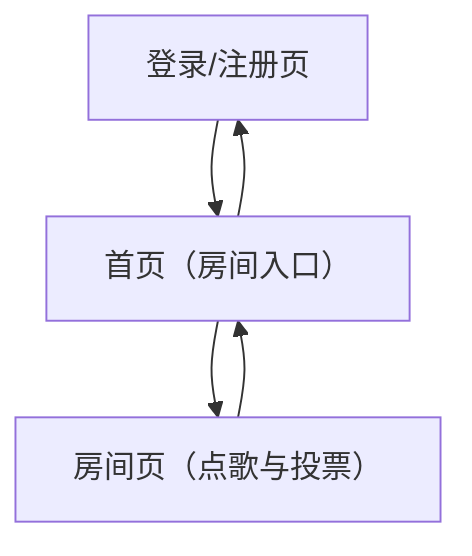

## 1. Product Overview
一个面向线下聚会/酒吧/社团活动的“房间点歌与投票”网页应用：你创建房间，大家加入后点歌、投票决定播放顺序，房主可管理权限与黑名单。
核心目标：用更低管理成本让多人协作点歌更公平、更可控。

### 1.1 体验目标（现代审美与交互）
- 信息分层清晰：三栏布局（成员/黑名单｜播放与队列｜搜索与设置），降低“找功能”的成本
- 实时反馈稳定：队列与票数更新不跳屏；所有操作有明确 loading/成功/失败提示
- 权限可理解：不同角色只看到自己能做的事（Host 面板默认不出现给 Member）

## 2. Core Features

### 2.1 User Roles
| 角色 | 注册/进入方式 | 核心权限 |
|------|----------------|----------|
| 房主（Host） | 登录后创建房间自动成为房主 | 管理房间设置、管理成员/权限、处理点歌队列、设置投票规则、黑名单管理 |
| 管理员（Moderator，可选） | 房主在房间内授予 | 协助管理队列（置顶/移除）、处理违规点歌/用户、发起踢人 |
| 普通成员（Member） | 通过房间码/链接加入（可匿名或登录，取决于房间设置） | 搜索/点歌、对歌曲投票、查看队列与当前播放信息 |

### 2.2 Feature Module
我们的网页应用由以下核心页面组成：
1. **登录/注册页**：账号登录、注册、退出、基础风控（验证码/频率限制可后置）。
2. **首页（房间入口）**：创建房间、加入房间（输入房间码/粘贴链接）、最近访问房间列表。
3. **房间页（点歌与投票）**：当前播放、点歌搜索与提交、队列列表、投票、房间成员与权限、黑名单与管理操作。

### 2.3 Page Details
| Page Name | Module Name | Feature description |
|-----------|-------------|---------------------|
| 登录/注册页 | 账号认证 | 完成注册、登录、退出；在登录态下自动跳转首页 |
| 首页（房间入口） | 创建房间 | 创建房间并设置：房间名、是否允许匿名加入、投票规则（阈值/比例）、每人点歌上限、是否允许重复歌曲 |
| 首页（房间入口） | 加入房间 | 通过房间码/链接加入；若房间要求登录则引导登录；加入成功跳转房间页 |
| 首页（房间入口） | 最近房间 | 展示最近访问房间；快速重新进入 |
| 房间页（点歌与投票） | 房间头部信息 | 展示房间名、房间码、在线人数、你的角色；提供复制邀请链接 |
| 房间页（点歌与投票） | 当前播放区 | 展示“正在播放/下一首”；房主可标记播放完成并切歌到下一首 |
| 房间页（点歌与投票） | 点歌搜索与提交 | 输入关键字搜索歌曲（基于后端曲库/第三方聚合结果）；选择后提交点歌；校验黑名单、重复、频率/数量限制 |
| 房间页（点歌与投票） | 队列与排序 | 展示待播放列表：歌曲信息、点歌人、时间、票数；按规则排序（默认：票数+时间综合）；房主/管理员可置顶、移除、锁定 |
| 房间页（点歌与投票） | 投票 | 对队列歌曲进行赞成/反对或“跳过投票”；达到阈值触发自动置顶/切歌（按房间配置） |
| 房间页（点歌与投票） | 成员与权限 | 展示成员列表与角色；房主可授予/撤销管理员；可踢出成员 |
| 房间页（点歌与投票） | 黑名单 | 房主/管理员可对用户/设备进行拉黑与解除；被拉黑者不可加入/点歌/投票（按配置） |
| 房间页（点歌与投票） | 房间设置 | 房主可编辑投票规则、匿名策略、限额策略；更改即时生效并广播到在线成员 |

## 3. Core Process

### 3.1 房主流程（Host Flow）
1) 你登录后在首页创建房间，设置投票阈值、匿名策略、点歌限制等。
2) 你在房间页复制邀请链接/房间码发给大家。
3) 你根据现场情况管理队列：置顶、移除、锁定，必要时踢人/拉黑。
4) 歌曲播放结束后，你标记“下一首”，系统按排序规则推送下一首给全员。

### 3.2 成员流程（Member Flow）
1) 你在首页输入房间码/点击邀请链接进入房间。
2) 你在房间页搜索歌曲并提交点歌；提交后进入队列。
3) 你对队列歌曲投票影响排序；当达到阈值会触发置顶/切歌等效果（取决于房间设置）。

