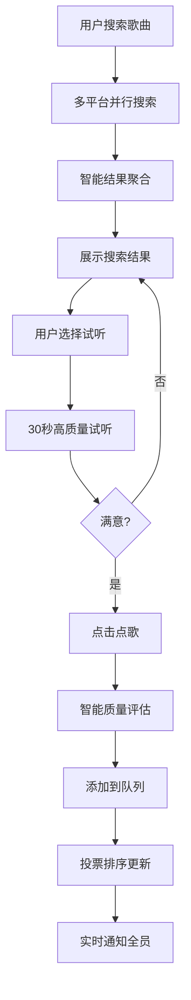
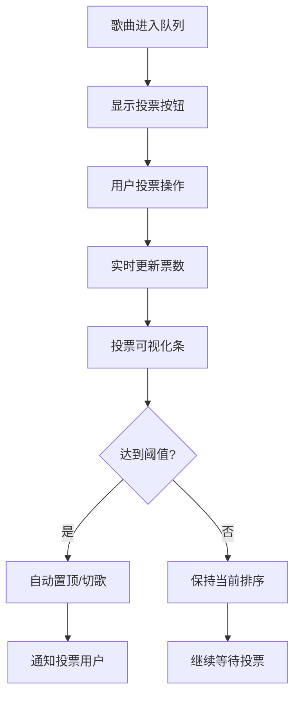
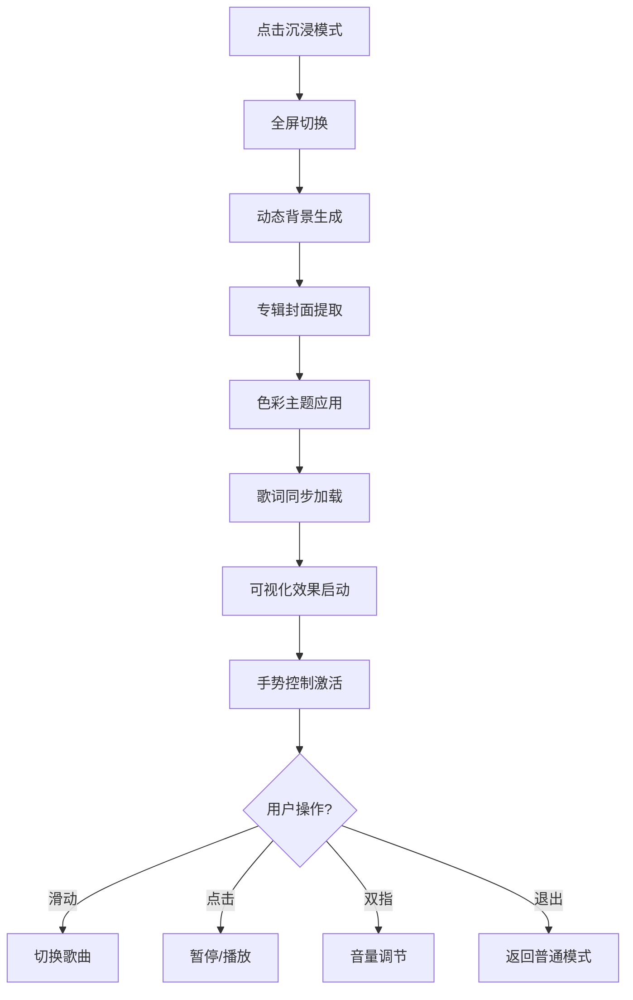

# 现代化沉浸式音乐点歌系统 - 产品需求文档

## 1. 产品概述

一个面向线下聚会、酒吧、社团活动的现代化沉浸式音乐协作平台。采用Glassmorphism设计风格，集成多平台音乐资源（网易云、QQ音乐、咪咕等），提供智能搜索、投票排序、沉浸式播放体验。

**核心价值**：通过现代化设计和智能技术，让多人协作点歌变得更美观、更智能、更有趣。

## 2. 核心功能

### 2.1 用户角色

| 角色 | 注册/进入方式 | 核心权限 |
|------|----------------|----------|
| 房主（Host） | 登录后创建房间自动成为房主 | 房间设置、成员管理、队列控制、音乐源配置、主题设置 |
| 管理员（Moderator） | 房主在房间内授予 | 协助管理队列、处理违规、投票管理 |
| 普通成员（Member） | 通过房间码/链接加入 | 搜索点歌、投票排序、试听预览、个人偏好 |
| 访客（Guest） | 无需注册，匿名加入 | 基础点歌、投票、受限搜索 |

### 2.2 功能模块

我们的现代化音乐协作平台由以下核心页面组成：

1. **沉浸式登录页**：动态背景、毛玻璃效果、社交登录
2. **现代化首页**：房间创建/加入、最近访问、热门推荐
3. **智能房间页**：三栏沉浸式布局、实时播放、智能搜索、投票可视化
4. **沉浸播放页**：全屏播放、动态背景、歌词同步、可视化效果
5. **个人中心**：偏好设置、历史记录、收藏管理、主题定制

### 2.3 页面详情

| 页面名称 | 模块名称 | 功能描述 |
|-----------|-------------|---------------------|
| 沉浸式登录页 | 动态背景 | 展示音乐可视化粒子效果，支持键盘交互 |
| 沉浸式登录页 | 毛玻璃登录框 | 半透明悬浮卡片，支持邮箱/社交账号登录 |
| 沉浸式登录页 | 品牌展示 | 大字体标语和动效logo，营造音乐氛围 |
| 现代化首页 | 房间创建 | 创建房间并设置：房间名、主题风格、音乐源偏好、隐私设置 |
| 现代化首页 | 房间加入 | 通过房间码/链接/扫码加入，支持快速加入 |
| 现代化首页 | 推荐房间 | 基于地理位置和兴趣推荐活跃房间 |
| 现代化首页 | 最近访问 | 展示最近访问房间，支持一键重连 |
| 智能房间页 | 顶部导航栏 | 房间信息、在线人数、邀请功能、主题切换 |
| 智能房间页 | 左侧成员栏 | 成员列表、角色标识、权限管理、黑名单 |
| 智能房间页 | 中央播放区 | 当前播放卡片、播放控制、进度显示、下一首预览 |
| 智能房间页 | 智能搜索栏 | 多平台搜索、实时建议、试听功能、批量点歌 |
| 智能房间页 | 播放队列 | 投票可视化排序、拖拽重排、批量操作、状态标识 |
| 智能房间页 | 右侧设置 | 房间设置、音乐源配置、投票规则、主题选择 |
| 沉浸播放页 | 全屏背景 | 动态专辑封面、毛玻璃效果、色彩提取 |
| 沉浸播放页 | 播放控制 | 大按钮设计、手势支持、进度条、音量控制 |
| 沉浸播放页 | 歌词展示 | 同步歌词显示、翻译切换、字体大小调节 |
| 沉浸播放页 | 可视化效果 | 音频频谱、粒子效果、背景动画 |
| 个人中心 | 个人信息 | 头像、昵称、等级、成就系统 |
| 个人中心 | 偏好设置 | 音乐源偏好、音质选择、主题定制 |
| 个人中心 | 历史记录 | 点歌历史、投票记录、播放统计 |
| 个人中心 | 收藏管理 | 收藏歌曲、歌单管理、导入导出 |

## 3. 核心流程

### 3.1 智能点歌流程


### 3.2 投票可视化流程


### 3.3 沉浸播放模式


## 4. 用户界面设计

### 4.1 设计系统

#### 色彩系统
- **主色调**：#1DB954（Spotify绿）- 音乐与活力
- **深色背景**：#121212（深炭黑）- 沉浸感
- **毛玻璃**：rgba(18, 18, 18, 0.8) - 现代感
- **强调色**：#1ED760（亮绿）- 交互状态
- **警告色**：#E91E63（粉红）- 重要操作
- **成功色**：#4CAF50（绿色）- 完成状态

#### 字体系统
- **标题字体**：Inter Bold, 32-48px
- **正文字体**：Inter Regular, 14-16px
- **数字字体**：Roboto Mono, 12-14px
- **行高比例**：1.4-1.6倍

#### 间距系统
- **基础单位**：4px
- **组件间距**：8px, 16px, 24px, 32px
- **页面边距**：16px(移动端), 24px(平板), 32px(桌面)

#### 动效系统
- **过渡时间**：0.2s(快速), 0.3s(标准), 0.5s(缓慢)
- **缓动函数**：ease-out(进入), ease-in-out(交互)
- **延迟层级**：50ms递增

### 4.2 组件设计

#### 毛玻璃卡片
```css
.glass-card {
  background: rgba(255, 255, 255, 0.1);
  backdrop-filter: blur(20px);
  border: 1px solid rgba(255, 255, 255, 0.2);
  border-radius: 16px;
  box-shadow: 0 8px 32px rgba(0, 0, 0, 0.3);
  transition: all 0.3s ease;
}

.glass-card:hover {
  transform: translateY(-4px);
  box-shadow: 0 12px 48px rgba(0, 0, 0, 0.4);
}
```

#### 投票可视化组件
```vue
<template>
  <div class="vote-visualization">
    <div class="vote-bar-container">
      <div class="vote-bar">
        <div 
          class="vote-fill positive"
          :style="{ width: positivePercentage + '%' }"
        ></div>
        <div 
          class="vote-fill negative"
          :style="{ width: negativePercentage + '%' }"
        ></div>
      </div>
      <div class="vote-indicator" :style="{ left: indicatorPosition + '%' }"></div>
    </div>
    <div class="vote-stats">
      <span class="positive-count">👍 {{ positiveVotes }}</span>
      <span class="negative-count">👎 {{ negativeVotes }}</span>
    </div>
  </div>
</template>
```

#### 智能搜索框
```vue
<template>
  <div class="smart-search">
    <div class="search-input-container">
      <input 
        v-model="searchQuery"
        type="text"
        placeholder="搜索歌曲、歌手、专辑..."
        class="search-input"
        @input="handleSearch"
        @focus="showSuggestions = true"
      />
      <button class="search-button" @click="performSearch">
        <svg class="search-icon"><!-- 搜索图标 --></svg>
      </button>
    </div>
    
    <transition name="fade">
      <div v-if="showSuggestions && suggestions.length" class="search-suggestions">
        <div 
          v-for="suggestion in suggestions" 
          :key="suggestion.id"
          class="suggestion-item"
          @click="selectSuggestion(suggestion)"
        >
          
          <div class="suggestion-info">
            <div class="suggestion-title">{{ suggestion.title }}</div>
            <div class="suggestion-artist">{{ suggestion.artist }}</div>
          </div>
          <button class="preview-button" @click.stop="previewSong(suggestion)">
            试听
          </button>
        </div>
      </div>
    </transition>
  </div>
</template>
```

### 4.3 响应式设计

#### 断点设置
- **移动端**：320px - 767px
- **平板端**：768px - 1023px  
- **桌面端**：1024px - 1439px
- **大屏端**：1440px+

#### 布局适配
```css
/* 移动端：单栏布局 */
@media (max-width: 767px) {
  .room-layout {
    grid-template-columns: 1fr;
    grid-template-rows: auto 1fr auto;
  }
  
  .sidebar-left,
  .sidebar-right {
    display: none;
  }
  
  .mobile-nav {
    display: flex;
    position: fixed;
    bottom: 0;
    left: 0;
    right: 0;
  }
}

/* 平板端：双栏布局 */
@media (min-width: 768px) and (max-width: 1023px) {
  .room-layout {
    grid-template-columns: 280px 1fr;
  }
  
  .sidebar-right {
    display: none;
  }
}

/* 桌面端：三栏布局 */
@media (min-width: 1024px) {
  .room-layout {
    grid-template-columns: 320px 1fr 320px;
  }
}
```

### 4.4 无障碍设计

#### 键盘导航
```vue
<template>
  <div 
    class="song-item"
    tabindex="0"
    role="button"
    :aria-label="`歌曲 ${song.title}，歌手 ${song.artist}，按Enter播放，按空格投票`"
    @keydown.enter="playSong"
    @keydown.space.prevent="voteSong"
    @keydown.arrowup.prevent="focusPrevious"
    @keydown.arrowdown.prevent="focusNext"
  >
    <!-- 内容 -->
  </div>
</template>
```

#### 屏幕阅读器支持
```vue
<template>
  <div class="visually-hidden" aria-live="polite">
    <span v-if="announcement">{{ announcement }}</span>
  </div>
</template>

<style>
.visually-hidden {
  position: absolute;
  width: 1px;
  height: 1px;
  padding: 0;
  margin: -1px;
  overflow: hidden;
  clip: rect(0, 0, 0, 0);
  white-space: nowrap;
  border: 0;
}
</style>
```

## 5. 技术特性

### 5.1 智能音乐源聚合
- **多平台搜索**：并行搜索网易云、QQ音乐、咪咕等平台
- **智能排序**：基于音质、版权、稳定性综合评分
- **容错机制**：单平台失败自动切换，保证可用性
- **质量评估**：实时检测音乐链接有效性

### 5.2 实时协作技术
- **WebSocket连接**：低延迟实时通信
- **状态同步**：房间状态、队列变化实时同步
- **冲突解决**：投票冲突、操作冲突智能处理
- **断线重连**：网络异常自动恢复连接

### 5.3 性能优化
- **虚拟滚动**：长列表高性能渲染
- **图片懒加载**：减少初始加载时间
- **代码分割**：按需加载功能模块
- **缓存策略**：多层级缓存提升响应速度

### 5.4 数据安全
- **权限控制**：基于角色的访问控制
- **数据加密**：敏感信息加密存储
- **审计日志**：重要操作记录追踪
- **隐私保护**：用户数据最小化收集

## 6. 商业模式

### 6.1 免费功能
- 基础房间创建和加入
- 多平台音乐搜索
- 基础投票排序
- 标准音质播放

### 6.2 高级功能（付费）
- 无损音质播放
- 高级主题定制
- 大数据分析报告
- 商业用途授权
- 专属客服支持

### 6.3 增值功能
- 个性化推荐
- 社交分享功能
- 活动统计分析
- 品牌定制服务

## 7. 成功指标

### 7.1 用户体验指标
- 页面加载时间 < 2秒
- 搜索响应时间 < 500ms
- 投票操作延迟 < 100ms
- 用户满意度 > 4.5/5.0

### 7.2 技术指标
- 系统可用性 > 99.9%
- 并发用户支持 > 1000人
- 音乐源成功率 > 95%
- 移动端兼容性 > 98%

### 7.3 业务指标
- 日活跃用户增长 > 20%/月
- 用户留存率 > 60%/周
- 付费转化率 > 5%
- 用户推荐率 > 70%

这个现代化沉浸式音乐点歌系统将通过优秀的设计、智能的技术和流畅的体验，重新定义多人音乐协作的方式，为用户带来前所未有的音乐社交体验。