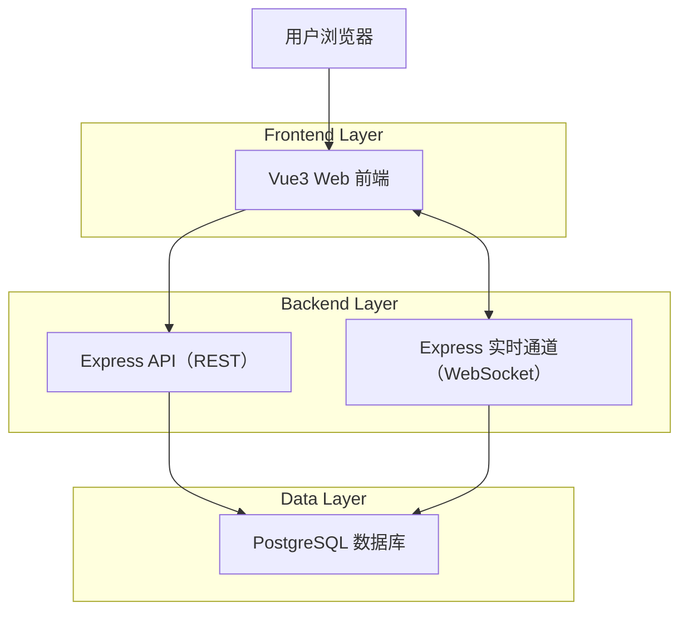
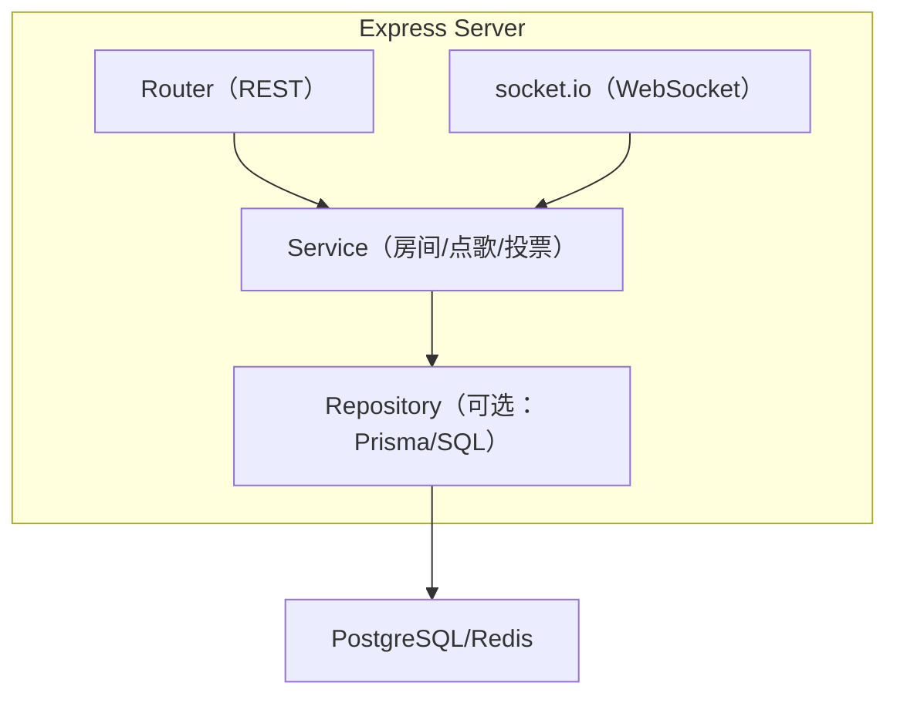
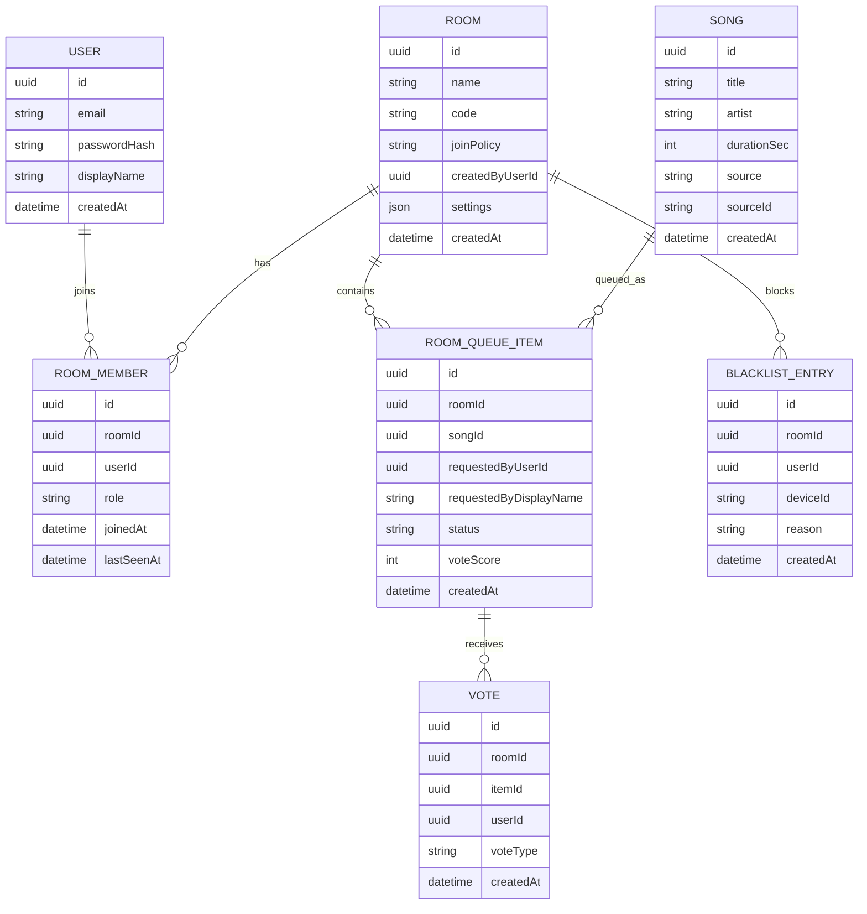

## 1.Architecture design



## 2.Technology Description
- Frontend: Vue@3 + TypeScript + Vite + Vue Router + Element Plus + TailwindCSS
- 状态管理: Zustand（使用 `zustand/vanilla` + Vue Composable 封装，用于全局房间状态）
- 数据获取: Axios + SWRV（SWR 的 Vue 实现；用于 REST 拉取与兜底轮询）
- 实时通道: socket.io-client（监听 `queue:update` / `vote:update` / `user:kicked`）
- 动效: 基础过渡使用 Vue Transition/TransitionGroup；复杂动效使用 @vueuse/motion（对应 React 生态的 Framer Motion）
- Backend: Node.js + Express + TypeScript + socket.io
- 数据存储: MVP 用内存存储（可切换 Redis/PostgreSQL；房间/队列/投票/黑名单）

## 3.Route definitions
| Route | Purpose |
|-------|---------|
| /login | 登录/注册页，完成认证与跳转 |
| / | 首页（房间入口）：创建/加入房间、最近房间 |
| /rooms/:roomId | 房间页：点歌、队列、投票、成员与黑名单管理 |

## 4.API definitions

### 4.1 TypeScript shared types（前后端通用核心模型）
```ts
export type RoomRole = 'HOST' | 'MODERATOR' | 'MEMBER';

export type RoomJoinPolicy = 'ANONYMOUS_ALLOWED' | 'LOGIN_REQUIRED';

export type VoteType = 'UP' | 'DOWN' | 'SKIP';

export interface Room {
  id: string;
  name: string;
  code: string; // 短码，便于线下输入
  joinPolicy: RoomJoinPolicy;
  createdByUserId: string;
  createdAt: string;
}

export interface Song {
  id: string;
  title: string;
  artist?: string;
  durationSec?: number;
  source: 'LOCAL' | 'THIRD_PARTY';
  sourceId?: string; // 第三方平台的唯一标识
}

export interface RoomQueueItem {
  id: string;
  roomId: string;
  songId: string;
  requestedByUserId?: string;
  requestedByDisplayName: string;
  status: 'QUEUED' | 'PLAYING' | 'PLAYED' | 'REMOVED';
  voteScore: number;
  createdAt: string;
}
```

### 4.2 REST API（核心）

认证
- POST /api/auth/register
- POST /api/auth/login
- POST /api/auth/logout
- GET  /api/auth/me

房间
- POST /api/rooms
  - 创建房间（房间名、joinPolicy、投票规则、点歌限制等）
- POST /api/rooms/join
  - 通过 code/joinToken 加入房间（返回 roomId 与你的角色）
- GET /api/rooms/:roomId
  - 获取房间详情与配置
- PATCH /api/rooms/:roomId
  - 更新房间配置（仅 HOST）

点歌与队列
- GET /api/rooms/:roomId/queue
  - 拉取队列（分页可后置，先全量）
- POST /api/rooms/:roomId/queue
  - 提交点歌（song 选择或创建引用）
- PATCH /api/rooms/:roomId/queue/:itemId
  - 管理队列（置顶/移除/锁定/标记 playing/played，HOST/MODERATOR）

投票
- POST /api/rooms/:roomId/queue/:itemId/votes
  - 对队列项投票（UP/DOWN/SKIP）

黑名单
- GET /api/rooms/:roomId/blacklist
- POST /api/rooms/:roomId/blacklist
  - 拉黑（按 userId 或 deviceId）
- DELETE /api/rooms/:roomId/blacklist/:blacklistId

歌曲搜索
- GET /api/songs/search?q=...
  - 返回候选歌曲列表（可对接第三方；最小可行版本可仅查本地曲库）

### 4.3 WebSocket 事件（实时同步）
命名空间：/ws
- client -> server
  - room:join { roomId }
  - queue:request { roomId, songId | songPayload, displayName }
  - vote:cast { roomId, itemId, voteType }
  - room:settings:update { roomId, patch }（仅 HOST）
  - queue:admin { roomId, itemId, action }（HOST/MODERATOR）
- server -> client（广播到 roomId 房间）
  - room:state { room, members, nowPlaying, queue }
  - queue:update { mode: 'replace' | 'patch', queue }
  - vote:update { itemId, voteScore }
  - member:updated { members }
  - blacklist:updated { blacklist }
  - user:kicked { roomId, reason }

## 4.4 前端工程规范（必须遵守）

### A) 工程与目录
- API 路由统一存放于 `/src/api/`（按 domain 拆分：`rooms.ts`、`songs.ts` 等；统一 `http.ts` 创建 axios 实例）
- WS 逻辑统一封装于 `/src/hooks/useWebSocket.ts`
- 类型统一放置于 `/src/types/`（`api.ts` 定义前后端共享的核心 interface）
- 状态管理统一放置于 `/src/stores/`（`useRoomStore.ts`，使用 Zustand 的 vanilla store + Vue composable 订阅）

### B) 关键逻辑规范
1. WebSocket 事件监听
   - 必须监听 `queue:update`（全量替换或增量更新队列）、`vote:update`（单项票数变更）、`user:kicked`（被踢出）
   - 收到 `queue:update` 时需保持滚动条位置：当用户不在列表顶部（例如 `scrollTop > 8px`）时，更新 DOM 后恢复“相对滚动位置”，避免跳屏
2. 操作反馈
   - 所有涉及状态变更的操作（投票、切歌、拉黑等），按钮必须立即进入 `loading` 状态，直到收到 Server 确认（REST 响应或 WS ack）
3. 权限控制
   - 前端必须根据 `currentUser.role` 控制 DOM 显隐（例如仅 Host 可见设置面板），不可仅依赖后端报错

### C) 组件拆分要求（房间页）
- `RoomPage`（主容器）
  - `RoomHeader`（顶部条）
  - `SidebarLeft`（左侧栏：`MemberList`, `BlacklistPanel`）
  - `MainStage`（主栏：`NowPlaying`, `QueueList`）
  - `SidebarRight`（右侧栏：`SongSearch`, `RoomSettings`）
- 每个 List Item 必须抽离为独立组件（例如 `QueueItem.vue`），并通过 `v-memo`/稳定 props/细粒度 store selector 降低不必要的重渲染

### D) 建议文件结构（前端）
说明：示例中的 `.tsx`/`React.memo` 为 React 生态惯例；本项目采用 Vue3，等价落地为 SFC + Composition API + `v-memo`。

```
/src
  /api
    http.ts
    rooms.ts
    songs.ts
  /components
    /room
      RoomPage.vue
      RoomHeader.vue
      SidebarLeft.vue
      SidebarRight.vue
      MainStage.vue
      /queue
        QueueList.vue
        QueueItem.vue
      /members
        MemberList.vue
        MemberItem.vue
      /blacklist
        BlacklistPanel.vue
      /nowPlaying
        NowPlaying.vue
      /search
        SongSearch.vue
      /settings
        RoomSettings.vue
  /hooks
    useWebSocket.ts
  /stores
    useRoomStore.ts
  /types
    api.ts
```

## 5.Server architecture diagram


## 6.Data model

### 6.1 Data model definition


### 6.2 Data Definition Language
User Table（users）
```sql
CREATE TABLE users (
  id UUID PRIMARY KEY DEFAULT gen_random_uuid(),
  email VARCHAR(255) UNIQUE NOT NULL,
  password_hash VARCHAR(255) NOT NULL,
  display_name VARCHAR(80) NOT NULL,
  created_at TIMESTAMPTZ NOT NULL DEFAULT now()
);
```

Room Table（rooms）
```sql
CREATE TABLE rooms (
  id UUID PRIMARY KEY DEFAULT gen_random_uuid(),
  name VARCHAR(120) NOT NULL,
  code VARCHAR(12) UNIQUE NOT NULL,
  join_policy VARCHAR(32) NOT NULL,
  created_by_user_id UUID NOT NULL,
  settings JSONB NOT NULL DEFAULT '{}'::jsonb,
  created_at TIMESTAMPTZ NOT NULL DEFAULT now()
);
CREATE INDEX idx_rooms_created_by ON rooms(created_by_user_id);
```

Room Members（room_members）
```sql
CREATE TABLE room_members (
  id UUID PRIMARY KEY DEFAULT gen_random_uuid(),
  room_id UUID NOT NULL,
  user_id UUID NOT NULL,
  role VARCHAR(16) NOT NULL,
  joined_at TIMESTAMPTZ NOT NULL DEFAULT now(),
  last_seen_at TIMESTAMPTZ
);
CREATE UNIQUE INDEX uniq_room_members_room_user ON room_members(room_id, user_id);
CREATE INDEX idx_room_members_room ON room_members(room_id);
```

Songs（songs）
```sql
CREATE TABLE songs (
  id UUID PRIMARY KEY DEFAULT gen_random_uuid(),
  title VARCHAR(200) NOT NULL,
  artist VARCHAR(200),
  duration_sec INT,
  source VARCHAR(24) NOT NULL,
  source_id VARCHAR(128),
  created_at TIMESTAMPTZ NOT NULL DEFAULT now()
);
CREATE INDEX idx_songs_source_source_id ON songs(source, source_id);
```

Queue Items（room_queue_items）
```sql
CREATE TABLE room_queue_items (
  id UUID PRIMARY KEY DEFAULT gen_random_uuid(),
  room_id UUID NOT NULL,
  song_id UUID NOT NULL,
  requested_by_user_id UUID,
  requested_by_display_name VARCHAR(80) NOT NULL,
  status VARCHAR(16) NOT NULL,
  vote_score INT NOT NULL DEFAULT 0,
  created_at TIMESTAMPTZ NOT NULL DEFAULT now()
);
CREATE INDEX idx_queue_room_status ON room_queue_items(room_id, status);
```

Votes（votes）
```sql
CREATE TABLE votes (
  id UUID PRIMARY KEY DEFAULT gen_random_uuid(),
  room_id UUID NOT NULL,
  item_id UUID NOT NULL,
  user_id UUID NOT NULL,
  vote_type VARCHAR(16) NOT NULL,
  created_at TIMESTAMPTZ NOT NULL DEFAULT now()
);
CREATE UNIQUE INDEX uniq_vote_item_user ON votes(item_id, user_id);
CREATE INDEX idx_votes_room_item ON votes(room_id, item_id);
```

Blacklist（blacklist_entries）
```sql
CREATE TABLE blacklist_entries (
  id UUID PRIMARY KEY DEFAULT gen_random_uuid(),
  room_id UUID NOT NULL,
  user_id UUID,
  device_id VARCHAR(128),
  reason VARCHAR(200),
  created_at TIMESTAMPTZ NOT NULL DEFAULT now()
);
CREATE INDEX idx_blacklist_room ON blacklist_entries(room_id);
```
