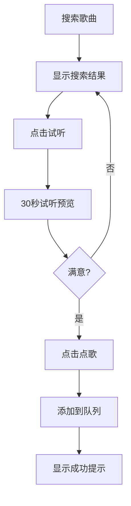

# 现代化沉浸式音乐点歌系统 UI/UX 设计方案

## 1. 设计理念

### 核心设计原则
- **Glassmorphism（毛玻璃效果）**：营造层次感和现代感
- **沉浸式体验**：让用户专注于音乐本身
- **移动端优先**：确保在各种设备上的优秀体验
- **流畅动效**：提供自然的交互反馈
- **深色主题**：减少视觉疲劳，突出音乐内容

### 视觉风格参考
- **Spotify**：简洁的卡片式布局
- **Apple Music**：大胆的视觉设计
- **YouTube Music**：动态的色彩系统

## 2. 色彩系统

### 主色调
- **主色**：#1DB954（Spotify绿）- 代表音乐与活力
- **辅助色**：#191414（深炭黑）- 背景主色
- **强调色**：#1ED760（亮绿）- 交互状态
- **警告色**：#E91E63（粉红）- 重要操作

### 渐变系统
```css
/* 主要渐变 */
.primary-gradient {
  background: linear-gradient(135deg, #1DB954 0%, #1ED760 100%);
}

/* 玻璃效果背景 */
.glass-effect {
  background: rgba(25, 20, 20, 0.8);
  backdrop-filter: blur(20px);
  border: 1px solid rgba(255, 255, 255, 0.1);
}

/* 卡片阴影 */
.card-shadow {
  box-shadow: 0 8px 32px rgba(0, 0, 0, 0.3);
}
```

## 3. 页面架构重构

### 3.1 整体布局
```
┌─────────────────────────────────────────────────────────┐
│                    顶部导航栏                            │
├─────────────────┬──────────────────┬─────────────────┤
│                 │                  │                 │
│   左侧边栏      │    主内容区       │   右侧边栏       │
│   (成员/管理)   │   (播放/队列)     │   (搜索/设置)    │
│                 │                  │                 │
│                 │                  │                 │
│                 │                  │                 │
├─────────────────┴──────────────────┴─────────────────┤
│                    底部播放器                          │
└─────────────────────────────────────────────────────────┘
```

### 3.2 响应式断点
- **移动端**：< 768px - 单栏布局
- **平板**：768px - 1024px - 双栏布局
- **桌面**：> 1024px - 三栏布局

## 4. 核心页面设计

### 4.1 登录/入口页

#### 视觉设计
- **全屏背景**：动态音乐可视化效果
- **毛玻璃登录框**：居中悬浮，半透明效果
- **品牌展示**：大字体标语"一起听歌吧"

#### 交互优化
```typescript
// 动态背景效果
const particlesConfig = {
  particles: {
    number: { value: 80, density: { enable: true, value_area: 800 } },
    color: { value: "#1DB954" },
    shape: { type: "circle" },
    opacity: { value: 0.5, random: false },
    size: { value: 3, random: true },
    line_linked: { enable: true, distance: 150, color: "#1DB954", opacity: 0.4, width: 1 }
  }
};
```

### 4.2 房间页（核心重构）

#### 顶部导航栏
```vue
<template>
  <nav class="glass-effect h-16 px-6 flex items-center justify-between">
    <div class="flex items-center space-x-4">
      <h1 class="text-xl font-bold text-white">{{ roomName }}</h1>
      <span class="text-sm text-gray-400">房间码: {{ roomCode }}</span>
    </div>
    <div class="flex items-center space-x-4">
      <span class="text-sm text-gray-400">{{ onlineCount }} 人在线</span>
      <button class="px-4 py-2 glass-effect rounded-lg hover:bg-opacity-90 transition-all">
        邀请链接
      </button>
    </div>
  </nav>
</template>
```

#### 左侧边栏 - 成员管理
```vue
<template>
  <aside class="glass-effect w-80 p-4 overflow-y-auto">
    <div class="mb-6">
      <h3 class="text-lg font-semibold text-white mb-4">房间成员</h3>
      <div class="space-y-2">
        <MemberItem 
          v-for="member in members" 
          :key="member.id"
          :member="member"
          :isHost="isHost"
          @promote="promoteToModerator"
          @kick="kickMember"
        />
      </div>
    </div>
    
    <div v-if="isHost || isModerator" class="mt-6">
      <h3 class="text-lg font-semibold text-white mb-4">黑名单</h3>
      <BlacklistPanel />
    </div>
  </aside>
</template>
```

#### 主内容区 - 播放控制
```vue
<template>
  <main class="flex-1 p-6">
    <!-- 当前播放 -->
    <section class="glass-effect rounded-2xl p-8 mb-6">
      <div class="flex items-center space-x-6">
        <div class="w-32 h-32 bg-gradient-to-br from-green-400 to-green-600 rounded-2xl flex items-center justify-center">
          <svg class="w-16 h-16 text-white" fill="currentColor" viewBox="0 0 24 24">
            <path d="M12 3v10.55c-.59-.34-1.27-.55-2-.55-2.21 0-4 1.79-4 4s1.79 4 4 4 4-1.79 4-4V7h4V3h-6z"/>
          </svg>
        </div>
        <div class="flex-1">
          <h2 class="text-3xl font-bold text-white mb-2">{{ currentSong?.title }}</h2>
          <p class="text-xl text-gray-300 mb-4">{{ currentSong?.artist }}</p>
          <div class="flex items-center space-x-4">
            <button class="px-6 py-3 primary-gradient rounded-full text-white font-semibold hover:shadow-lg transition-all">
              播放完成
            </button>
            <button class="px-6 py-3 glass-effect rounded-full text-white font-semibold hover:bg-white hover:bg-opacity-10 transition-all">
              跳过
            </button>
          </div>
        </div>
      </div>
    </section>

    <!-- 播放队列 -->
    <section class="glass-effect rounded-2xl p-6">
      <div class="flex items-center justify-between mb-6">
        <h3 class="text-xl font-semibold text-white">播放队列</h3>
        <div class="flex items-center space-x-2">
          <span class="text-sm text-gray-400">排序方式</span>
          <select class="glass-effect px-3 py-1 rounded-lg text-white text-sm">
            <option>投票优先</option>
            <option>时间优先</option>
            <option>点赞优先</option>
          </select>
        </div>
      </div>
      <QueueList :items="queueItems" @vote="handleVote" @reorder="reorderQueue" />
    </section>
  </main>
</template>
```

#### 右侧边栏 - 搜索点歌
```vue
<template>
  <aside class="glass-effect w-80 p-4 overflow-y-auto">
    <div class="mb-6">
      <h3 class="text-lg font-semibold text-white mb-4">搜索点歌</h3>
      <div class="relative mb-4">
        <input 
          v-model="searchQuery"
          type="text" 
          placeholder="搜索歌曲、歌手..."
          class="w-full px-4 py-3 glass-effect rounded-lg text-white placeholder-gray-400 focus:outline-none focus:ring-2 focus:ring-green-500"
        />
        <button class="absolute right-3 top-1/2 transform -translate-y-1/2 text-gray-400 hover:text-white">
          <svg class="w-5 h-5" fill="none" stroke="currentColor" viewBox="0 0 24 24">
            <path stroke-linecap="round" stroke-linejoin="round" stroke-width="2" d="M21 21l-6-6m2-5a7 7 0 11-14 0 7 7 0 0114 0z"/>
          </svg>
        </button>
      </div>
      <div class="space-y-2">
        <SongSearchItem 
          v-for="song in searchResults" 
          :key="song.id"
          :song="song"
          @select="addToQueue"
        />
      </div>
    </div>
    
    <div v-if="isHost" class="mt-6">
      <h3 class="text-lg font-semibold text-white mb-4">房间设置</h3>
      <RoomSettings />
    </div>
  </aside>
</template>
```

#### 底部播放器
```vue
<template>
  <footer class="glass-effect h-20 px-6 flex items-center justify-between">
    <div class="flex items-center space-x-4">
      <div class="w-12 h-12 bg-gradient-to-br from-green-400 to-green-600 rounded-lg flex items-center justify-center">
        <svg class="w-6 h-6 text-white" fill="currentColor" viewBox="0 0 24 24">
          <path d="M12 3v10.55c-.59-.34-1.27-.55-2-.55-2.21 0-4 1.79-4 4s1.79 4 4 4 4-1.79 4-4V7h4V3h-6z"/>
        </svg>
      </div>
      <div>
        <h4 class="text-white font-medium">{{ currentSong?.title }}</h4>
        <p class="text-gray-400 text-sm">{{ currentSong?.artist }}</p>
      </div>
    </div>
    
    <div class="flex items-center space-x-6">
      <button class="text-gray-400 hover:text-white transition-colors">
        <svg class="w-6 h-6" fill="currentColor" viewBox="0 0 24 24">
          <path d="M6 6h2v12H6zm3.5 6l8.5 6V6z"/>
        </svg>
      </button>
      <button class="w-12 h-12 primary-gradient rounded-full flex items-center justify-center text-white hover:shadow-lg transition-all">
        <svg class="w-6 h-6" fill="currentColor" viewBox="0 0 24 24">
          <path d="M8 5v14l11-7z"/>
        </svg>
      </button>
      <button class="text-gray-400 hover:text-white transition-colors">
        <svg class="w-6 h-6" fill="currentColor" viewBox="0 0 24 24">
          <path d="M6 18l8.5-6L6 6v12zM16 6v12h2V6h-2z"/>
        </svg>
      </button>
    </div>
    
    <div class="flex items-center space-x-4">
      <span class="text-sm text-gray-400">{{ currentTime }} / {{ duration }}</span>
      <div class="w-32 h-1 bg-gray-600 rounded-full">
        <div class="h-full bg-green-500 rounded-full" :style="{ width: progress + '%' }"></div>
      </div>
    </div>
  </footer>
</template>
```

## 5. 交互动效设计

### 5.1 页面转场
```css
/* 页面切换动画 */
.page-enter-active {
  transition: all 0.3s ease-out;
}

.page-leave-active {
  transition: all 0.3s ease-in;
}

.page-enter-from {
  opacity: 0;
  transform: translateY(30px);
}

.page-leave-to {
  opacity: 0;
  transform: translateY(-30px);
}
```

### 5.2 组件动效
```css
/* 卡片悬停效果 */
.card-hover {
  transition: all 0.3s ease;
}

.card-hover:hover {
  transform: translateY(-4px);
  box-shadow: 0 12px 40px rgba(0, 0, 0, 0.4);
}

/* 按钮点击波纹效果 */
.button-ripple {
  position: relative;
  overflow: hidden;
}

.button-ripple::after {
  content: '';
  position: absolute;
  top: 50%;
  left: 50%;
  width: 0;
  height: 0;
  border-radius: 50%;
  background: rgba(255, 255, 255, 0.3);
  transform: translate(-50%, -50%);
  transition: width 0.6s, height 0.6s;
}

.button-ripple:active::after {
  width: 300px;
  height: 300px;
}
```

### 5.3 投票动效
```vue
<template>
  <div class="vote-buttons flex items-center space-x-2">
    <button 
      @click="vote('up')"
      :class="[
        'vote-btn flex items-center space-x-1 px-3 py-1 rounded-full transition-all',
        userVote === 'up' ? 'bg-green-500 text-white' : 'glass-effect text-gray-300'
      ]"
    >
      <svg class="w-4 h-4" fill="currentColor" viewBox="0 0 24 24">
        <path d="M7 14l5-5 5 5z"/>
      </svg>
      <span class="text-sm font-medium">{{ upVotes }}</span>
    </button>
    
    <button 
      @click="vote('down')"
      :class="[
        'vote-btn flex items-center space-x-1 px-3 py-1 rounded-full transition-all',
        userVote === 'down' ? 'bg-red-500 text-white' : 'glass-effect text-gray-300'
      ]"
    >
      <svg class="w-4 h-4" fill="currentColor" viewBox="0 0 24 24">
        <path d="M7 10l5 5 5-5z"/>
      </svg>
      <span class="text-sm font-medium">{{ downVotes }}</span>
    </button>
  </div>
</template>

<style>
.vote-btn {
  transform: scale(1);
  transition: all 0.2s ease;
}

.vote-btn:hover {
  transform: scale(1.05);
}

.vote-btn:active {
  transform: scale(0.95);
}
</style>
```

## 6. 响应式设计细节

### 6.1 移动端适配
```css
/* 移动端布局调整 */
@media (max-width: 768px) {
  .desktop-layout {
    display: none;
  }
  
  .mobile-layout {
    display: block;
  }
  
  .bottom-nav {
    position: fixed;
    bottom: 0;
    left: 0;
    right: 0;
    height: 60px;
    background: rgba(25, 20, 20, 0.95);
    backdrop-filter: blur(20px);
    border-top: 1px solid rgba(255, 255, 255, 0.1);
  }
}
```

### 6.2 触摸优化
```css
/* 触摸目标大小 */
.touch-target {
  min-width: 44px;
  min-height: 44px;
  display: flex;
  align-items: center;
  justify-content: center;
}

/* 触摸反馈 */
.touch-feedback {
  -webkit-tap-highlight-color: transparent;
  user-select: none;
}

.touch-feedback:active {
  background-color: rgba(255, 255, 255, 0.1);
  transform: scale(0.98);
}
```

## 7. 可访问性优化

### 7.1 键盘导航
```vue
<template>
  <div 
    class="queue-item"
    tabindex="0"
    @keydown.enter="selectItem"
    @keydown.space.prevent="toggleVote"
    role="button"
    :aria-label="`歌曲 ${song.title}，按Enter选择，按空格投票`"
  >
    <!-- 内容 -->
  </div>
</template>
```

### 7.2 屏幕阅读器支持
```vue
<template>
  <div class="visually-hidden">
    <span aria-live="polite">{{ announcement }}</span>
  </div>
</template>

<style>
.visually-hidden {
  position: absolute;
  width: 1px;
  height: 1px;
  padding: 0;
  margin: -1px;
  overflow: hidden;
  clip: rect(0, 0, 0, 0);
  white-space: nowrap;
  border: 0;
}
</style>
```

## 8. 性能优化

### 8.1 虚拟滚动
```javascript
// 长列表虚拟滚动优化
import { VirtualList } from 'vue-virtual-scroll-list';

export default {
  components: { VirtualList },
  data() {
    return {
      queueItems: [], // 大量数据
      itemHeight: 80
    };
  }
};
```

### 8.2 图片懒加载
```vue
<template>
  
</template>
```

### 8.3 动效性能
```css
/* 使用transform和opacity优化动效 */
.optimized-animation {
  will-change: transform, opacity;
  transform: translateZ(0); /* 开启硬件加速 */
}
```

## 9. 主题系统

### 9.1 CSS变量定义
```css
:root {
  --primary-color: #1DB954;
  --secondary-color: #191414;
  --text-primary: #ffffff;
  --text-secondary: #b3b3b3;
  --glass-bg: rgba(25, 20, 20, 0.8);
  --glass-border: rgba(255, 255, 255, 0.1);
  --shadow-sm: 0 2px 8px rgba(0, 0, 0, 0.1);
  --shadow-lg: 0 8px 32px rgba(0, 0, 0, 0.3);
}

[data-theme="light"] {
  --secondary-color: #ffffff;
  --text-primary: #191414;
  --text-secondary: #6b7280;
  --glass-bg: rgba(255, 255, 255, 0.8);
  --glass-border: rgba(0, 0, 0, 0.1);
}
```

### 9.2 主题切换组件
```vue
<template>
  <button 
    @click="toggleTheme"
    class="theme-toggle glass-effect p-2 rounded-lg"
    :aria-label="`切换到${isDark ? '亮色' : '深色'}主题`"
  >
    <svg v-if="isDark" class="w-5 h-5" fill="currentColor" viewBox="0 0 24 24">
      <path d="M12 3v1m0 16v1m9-9h-1M4 12H3m15.364 6.364l-.707-.707M6.343 6.343l-.707-.707m12.728 0l-.707.707M6.343 17.657l-.707.707M16 12a4 4 0 11-8 0 4 4 0 018 0z"/>
    </svg>
    <svg v-else class="w-5 h-5" fill="currentColor" viewBox="0 0 24 24">
      <path d="M21 12.79A9 9 0 1111.21 3 7 7 0 0021 12.79z"/>
    </svg>
  </button>
</template>

<script setup>
import { ref, onMounted } from 'vue';

const isDark = ref(true);

const toggleTheme = () => {
  isDark.value = !isDark.value;
  document.documentElement.setAttribute('data-theme', isDark.value ? 'dark' : 'light');
  localStorage.setItem('theme', isDark.value ? 'dark' : 'light');
};

onMounted(() => {
  const savedTheme = localStorage.getItem('theme') || 'dark';
  isDark.value = savedTheme === 'dark';
  document.documentElement.setAttribute('data-theme', savedTheme);
});
</script>
```

## 10. 交互流程优化

### 10.1 搜索-试听-点歌流程


### 10.2 投票可视化
```vue
<template>
  <div class="vote-visualization">
    <div class="vote-bar">
      <div 
        class="vote-fill positive"
        :style="{ width: positivePercentage + '%' }"
      ></div>
      <div 
        class="vote-fill negative"
        :style="{ width: negativePercentage + '%' }"
      ></div>
    </div>
    <div class="vote-stats">
      <span class="positive-count">👍 {{ positiveVotes }}</span>
      <span class="negative-count">👎 {{ negativeVotes }}</span>
    </div>
  </div>
</template>

<style>
.vote-bar {
  height: 8px;
  background: rgba(255, 255, 255, 0.1);
  border-radius: 4px;
  overflow: hidden;
  display: flex;
  margin: 8px 0;
}

.vote-fill.positive {
  background: linear-gradient(90deg, #1DB954, #1ED760);
  transition: width 0.3s ease;
}

.vote-fill.negative {
  background: linear-gradient(90deg, #E91E63, #F06292);
  transition: width 0.3s ease;
}
</style>
```

### 10.3 沉浸播放模式
```vue
<template>
  <div 
    class="immersive-player"
    :class="{ 'immersive-active': isImmersive }"
  >
    <div class="immersive-background" :style="backgroundStyle"></div>
    <div class="immersive-content">
      <div class="album-art">
        
      </div>
      <div class="song-info">
        <h1 class="song-title">{{ currentSong.title }}</h1>
        <p class="song-artist">{{ currentSong.artist }}</p>
      </div>
      <div class="lyrics-panel" v-if="showLyrics">
        <p class="lyric-line" v-for="line in currentLyrics" :key="line.time">
          {{ line.text }}
        </p>
      </div>
    </div>
    <button @click="toggleImmersive" class="exit-immersive">
      <svg class="w-6 h-6" fill="currentColor" viewBox="0 0 24 24">
        <path d="M6 18L18 6M6 6l12 12"/>
      </svg>
    </button>
  </div>
</template>

<style>
.immersive-player {
  position: fixed;
  top: 0;
  left: 0;
  right: 0;
  bottom: 0;
  background: #000;
  z-index: 1000;
  opacity: 0;
  visibility: hidden;
  transition: all 0.3s ease;
}

.immersive-player.immersive-active {
  opacity: 1;
  visibility: visible;
}

.immersive-background {
  position: absolute;
  top: 0;
  left: 0;
  right: 0;
  bottom: 0;
  background-size: cover;
  background-position: center;
  filter: blur(20px) brightness(0.5);
}

.immersive-content {
  position: relative;
  z-index: 1;
  height: 100%;
  display: flex;
  flex-direction: column;
  align-items: center;
  justify-content: center;
  padding: 2rem;
}
</style>
</template>
```

## 11. 技术实现建议

### 11.1 组件库选择
- **Vue3 + TypeScript**：类型安全，开发体验好
- **Tailwind CSS**：快速实现设计系统
- **Headless UI**：无障碍组件支持
- **Framer Motion**：流畅动效（Vue可用@vueuse/motion）

### 11.2 状态管理
```typescript
// 使用 Pinia 管理全局状态
import { defineStore } from 'pinia';

export const useMusicStore = defineStore('music', {
  state: () => ({
    currentSong: null,
    queue: [],
    isPlaying: false,
    volume: 0.8,
    isImmersive: false,
    theme: 'dark'
  }),
  
  actions: {
    playSong(song: Song) {
      this.currentSong = song;
      this.isPlaying = true;
    },
    
    toggleImmersive() {
      this.isImmersive = !this.isImmersive;
    },
    
    setTheme(theme: string) {
      this.theme = theme;
      document.documentElement.setAttribute('data-theme', theme);
    }
  }
});
```

### 11.3 性能监控
```typescript
// 性能监控
const performanceMonitor = {
  measureComponentRender(componentName: string, renderFn: Function) {
    const start = performance.now();
    const result = renderFn();
    const end = performance.now();
    
    console.log(`${componentName} 渲染时间: ${end - start}ms`);
    
    if (end - start > 16) { // 超过一帧时间
      console.warn(`${componentName} 渲染性能警告: ${end - start}ms`);
    }
    
    return result;
  }
};
```

这个设计方案提供了一个现代化、沉浸式的音乐点歌系统UI/UX，结合了当前流行的设计趋势和优秀的用户体验原则。通过Glassmorphism效果、流畅的动效和响应式设计，创造了一个既美观又实用的音乐协作平台。